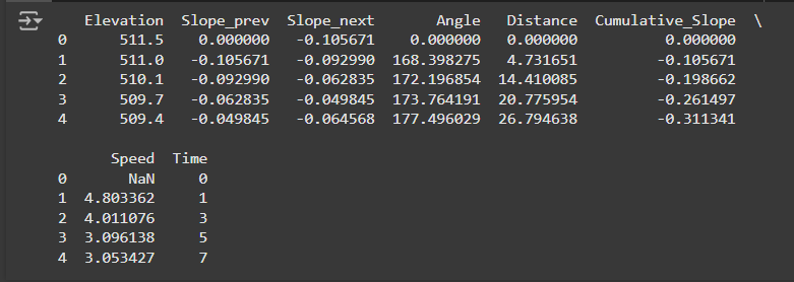

# Baseline Model

The baseline model aims to predict the speed of a rider (e.g., cyclist, runner) based on terrain characteristics and cumulative statistics of the current track. It utilizes two different machine learning algorithms
  

## Linear Regression

- Implementation: A simple linear regression model is trained using the LinearRegression class from scikit-learn.
- Features: It uses six features: 'Elevation', 'Slope_prev', 'Slope_next', 'Angle', 'Distance', and 'Cumulative_Slope'.
- Training: The model is trained on a portion of the dataset (X_train, y_train).
- Prediction: It predicts the speed (y_pred) for the test set (X_test) and new unseen data.
- Evaluation: The model's performance is evaluated using Mean Absolute Error (MAE).
  

## Simple Neural Network

- Implementation: A simple neural network with two hidden layers (64 and 32 neurons) is built using TensorFlow/Keras.
- Features: It uses the same six features as the linear regression model.
- Preprocessing: The features are normalized using StandardScaler before training.
- Training: The model is trained using the Adam optimizer and mean squared error loss function. It's trained for 10 epochs with a batch size of 32.
- Prediction: It predicts the speed for the test set and new unseen data after applying the same scaling to the input features.
- Evaluation: The model's performance is evaluated using test loss and MAE. The training history (loss over epochs) is optionally plotted.

  
  
<strong>Feature Engineering</strong>

  

## Evaluation and Comparison

Both models are evaluated on a separate test dataset and new unseen data. The evaluation metrics (MAE and percentage difference in predicted time) are used to compare their performance. The summary statistics provide insights into the accuracy and reliability of each model's predictions.

In summary, the baseline model provides two approaches (linear regression and neural network) for predicting rider speed based on terrain features. The code implements the training, prediction, and evaluation processes for both models, allowing for a comparison of their performance

  
  
<strong>MAE Performance Difference</strong>

  

  
  
<strong>MAE Performance</strong>

  
### *Detail Information on [Colab_Notebook_Baseline_Model](baseline_model_r1.ipynb)*
