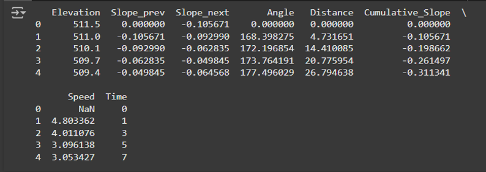
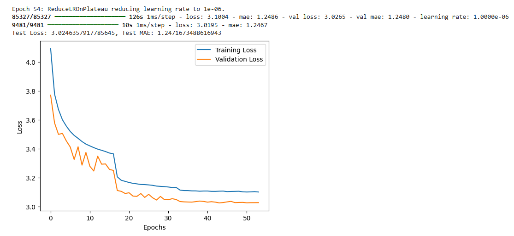

# Model Definition and Evaluation

## Model Selection
After the baseline model, final model was focused on predicting cycling speed and subsequently, the time taken for a route. To achieve this, two models are employed:
- Linear Regression (LR): This serves as the baseline model, representing a simpler approach. It assumes a linear relationship between the features (elevation, slope, etc.) and the target variable (speed). It's pre-trained and loaded from a file (r3_init_lr_model.joblib). This model provides a benchmark for comparison with more complex approaches.

- Neural Network (NN): This model leverages the power of deep learning to capture potentially non-linear relationships within the data. It's built using TensorFlow/Keras and consists of an input layer, hidden layers with activation functions (ReLU) and dropout for regularization, and an output layer. This structure allows the NN to learn complex patterns and make more nuanced predictions compared to the LR model.

  
  
<strong>Model Configuration</strong>

  

## Feature Engineering:
The selection of relevant features is crucial for accurate predictions. The code utilizes the following:

- Elevation: Represents the altitude of the terrain. Changes in elevation significantly influence cycling speed.
- Slope_prev & Slope_next: These capture the gradients of the terrain before and after the current point, providing context for the cyclist's effort.
- Angle: Measures the inclination of the terrain, further complementing the slope information.
- Distance: Represents the distance covered, which is directly related to the time taken.
- Cumulative_slope: This feature considers the accumulated slope over the route, reflecting the overall difficulty.

These features are chosen based on their physical relevance to cycling dynamics and their potential impact on speed and time.

  
  
<strong>Feature Engineering</strong>

  

## Hyperparameter Tuning:
Optimizing a neural network involves tuning its hyperparameters to achieve the best performance. The code incorporates callbacks within the training process:

- Early Stopping: This technique monitors the validation loss (performance on a separate dataset) during training. If the loss stops improving for a specified number of epochs (patience), training is stopped to prevent overfitting, where the model performs well on training data but poorly on unseen data.
- Model Checkpoint: This callback saves the model's weights whenever it achieves the best performance on the validation set. This ensures that you have access to the model's optimal state.
- ReduceLROnPlateu: The learning rate is a critical hyperparameter that controls how the model adjusts its weights during training. This callback automatically reduces the learning rate when the validation loss plateaus, allowing the model to fine-tune its parameters and converge to a better solution.

  
  
<strong>Hyper Parameters</strong>

  

## Implementation:
This project follows a standard workflow for machine learning projects:

- Data Loading: The training data is read from a CSV file (combined_data_r3.csv) using Pandas
- Data Splitting: The dataset is divided into training and testing sets using train_test_split. The training set is used to train the models, while the testing set is used to evaluate their performance on unseen data.
- Data Preprocessing: The features are scaled using StandardScaler to ensure they have similar ranges, which can improve model performance.
- Model Training: Both the LR and NN models are trained using their respective libraries. The NN is trained with the specified callbacks for hyperparameter tuning.
- Model Evaluation: The models are evaluated on the testing set using the Mean Absolute Error (MAE) metric. Lower MAE values indicate better predictive accuracy.

  
  
<strong>NN Model Training</strong>

  

## Evaluation Metrics
- Mean Absolute Error (MAE): This metric quantifies the average absolute difference between the predicted speed/time and the actual values. It's a straightforward measure of prediction error, with lower values indicating better model performance.

- Comparative Analysis: The code applies both trained models to separate test datasets (Rider3_test) to simulate real-world scenarios. It calculates the predicted time for each route and compares it with the actual time. Summary statistics, including the percentage difference between predicted and actual times, are generated to provide a comprehensive evaluation. This comparative analysis helps determine which model is more suitable for predicting cycling speed and time, based on their performance on independent test data.

  
  
<strong>Linear Regression Evaluation</strong>

  

  
  
<strong>Neutral Network Evaluation</strong>

  

  
  
<strong>Evaluation Summary</strong>

  

### *Detailed Information on [Colab Notebook_Final_Model](final_models/final_model.ipynb)*
